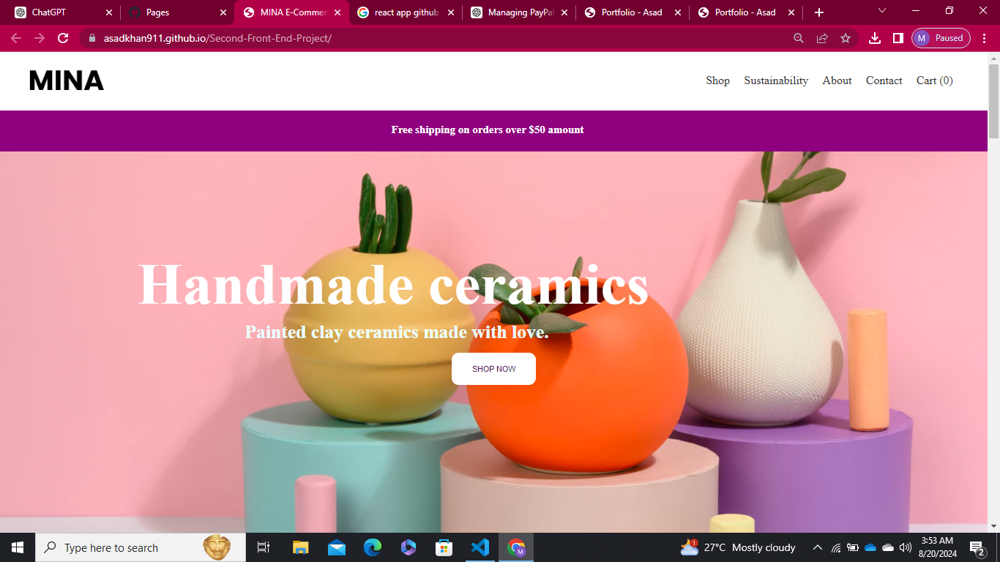

# MINA E-Commerce Store Landing Page

## Project Overview

This project is a clone of an e-commerce store landing page for a brand named **MINA**. It showcases the use of basic HTML and CSS to create a visually appealing landing page.

**Please note:** This project is **not** fully responsive. It is designed with fixed dimensions and may not display correctly on all screen sizes.

## Features

- **Static Design**: The landing page features a static design using HTML and CSS.

## Demo

You can view the live demo of the project by clicking the link below:

[**Demo View**](https://your-demo-link.com)

## Demo Images

Here are some screenshots of the landing page:

1. 

## Technologies Used

- HTML
- CSS

**License**:
   - Ensure you have a `LICENSE` file in your repository if you mention it in the README.

This README provides clear instructions and information about your project, including its limitations regarding responsiveness.
